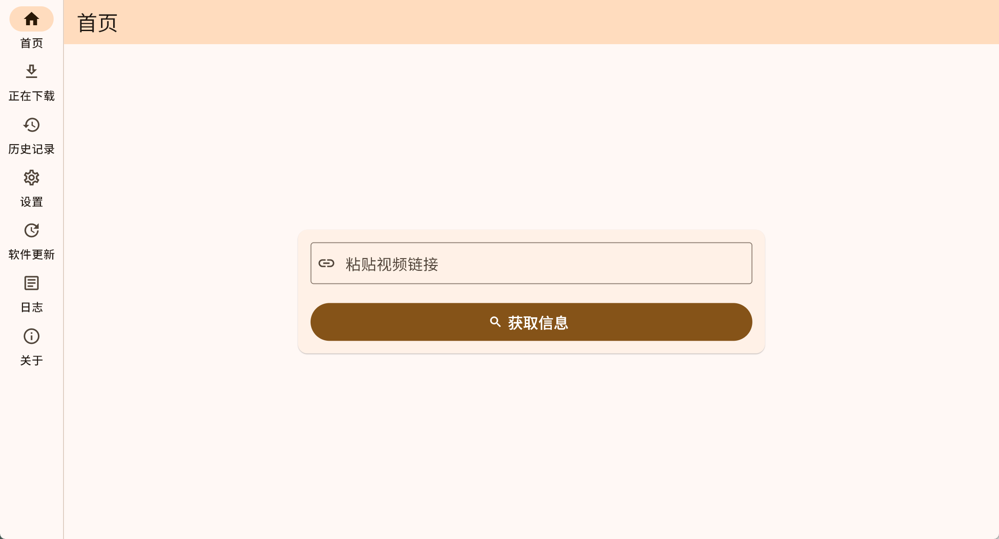

# Leuco

  

   
  
一个基于 yt-dlp 的 GUI 客户端，使用 Flutter 构建。

  
用于获取视频信息、选择格式并下载内容。

  <!-- 徽章部分 -->
  
  
  

---

## 特性

- **图形用户界面**: 为 `yt-dlp` 命令行工具提供了一个直观的图形界面。
- **格式选择**: 列出可用的视频、音频及混合格式，并按质量排序。
- **字幕支持**: 支持预览、嵌入或单独下载多语言字幕。
- **下载管理**: 提供下载队列，可查看任务进度、速度和状态。
- **历史记录**: 保存已完成或失败的任务以供查阅。
- **可配置**:
    - 提供浅色/深色模式及多种主题色。
    - 可调整全局字体大小。
    - 支持设置自定义代理服务器。
    - 支持配置默认下载路径。
- **组件更新**: 内置 `yt-dlp` 版本检查与更新功能。

## 截图

  
   <em>主页</em>

  
   <em>设置页</em>

## 安装

当前版本仅支持 **Windows (x64)** 平台。

1.  访问项目的 [**Releases**](https://github.com/WhiteBr1ck/Leuco/releases) 页面。
2.  下载最新版本的 `.zip` 压缩文件 (例如 `Leuco-v1.0.0-windows-x64.zip`)。
3.  解压到本地任意目录。
4.  运行 `leuco.exe` 即可启动程序。

> **说明**: 这是一个便携版应用，已包含运行所需的核心组件 (`yt-dlp`, `ffmpeg`)。

## 许可证 (License)

本项目使用 MIT 许可证。详细信息请参阅 [LICENSE](LICENSE) 文件。

## 免责声明

本软件是 `yt-dlp` 的一个图形化前端工具，用于帮助用户下载其**拥有合法使用权**或**已获得授权**的在线内容。

- 用户在使用本软件时，应遵守其所在国家/地区的法律法规以及内容来源网站的服务条款。
- 任何因不当使用本软件（例如，下载受版权保护的内容）而导致的法律责任，均由用户自行承担，开发者对此不负任何责任。
- 本软件仅供个人学习及技术研究使用，严禁用于任何商业或非法目的。

## 鸣谢

- **[yt-dlp](https://github.com/yt-dlp/yt-dlp)**: 本项目的核心下载功能由 `yt-dlp` 提供。
- **[Flutter](https://flutter.dev/)**: 本项目的用户界面由 Flutter 构建。
- **[FFmpeg](https://ffmpeg.org/)**: 用于处理音视频合并等媒体操作。

---

  由 [WhiteBr1ck](https://github.com/WhiteBr1ck) 开发。

